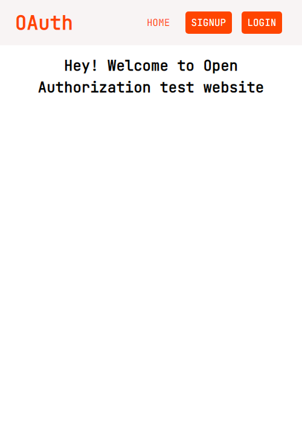

# Open Authorization

## Application that let users login with their google account
### The application was built using embedded javascript [EJS]

### Stacks/Tools Used

- Javascript
- Css
- Node/Express
- MongoDB database

[click here](https://grocery-bud-02.netlify.app/) to view the website online

### A screenshot of the website is shown below

## Installation

### The steps in running this project locally on your personal computer are listed below

- Clone the Repository
- Open the repository on your Personal Computer
- Run "npm install"
- After installation of all the dependencies
- Run "npm start"
- Congratulations.
